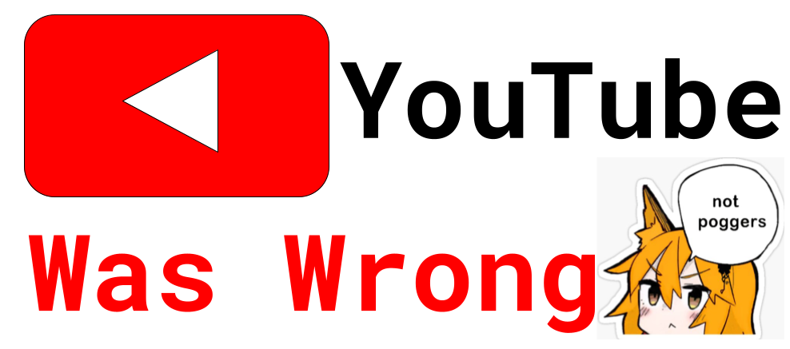

# UofTHacks IX YouTube Was Wrong

### Video

### Inspiration

YouTube removed the dislike button making it hard to judge whether a video was useful or not. We wanted to make it easy to search for what you needed and know if the video was like by its audience.

### What the application does?
Our application returns the functionality of YouTube took out not so long ago. We were able to ressurect the "dislike" button. With this We have restored the good old fashioned way of determining whether a YouTube was worth while watching (like/dislike ratio). We were able to restore the YouTube search to its former glory.

The user is prompted for something they'd like to restore followed by a prompt for a Google API key. The program then takes the search and API key to send a search request to YouTube. The returned videos are then sent through returnyoutubedislike.com's API to retrieve video information (likes/views/dislikes). A ratio is calculated between the likes and dislikes to find the highest rated video. The videos are then outputted from highest ratio to lowest for the user to select from. The information on the videos are also displayed so the user can pick another video if the first one isn't to their liking.

### Why we used the technologies you used?
With this project we were able to impliment Google's own YouTube API responsible for pulling video ID's and titles
Information about videos including dislikes and likes were retrieved using returnyoutubedislike.com

### Some of the challenges faced and features you hope to implement in the future.
Some challenges include working with an API for our first time. Making it very difficult for us to learn on the spot. We also did encounter some difficulty learning about sorting 2D arrays, as we haven't really learned this yet.

## Installation
Install Java, have a internet connection, and get a Google API Key. 

## Usage
Type your search into the console. Then input the Google API Key. Then tadah your results sorted by the likes/dislikes ratio.

## Creation
Submitted by James Liang, Vincent Trung for UofTHacks IX 2022